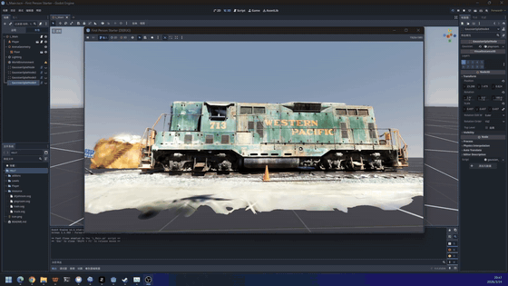
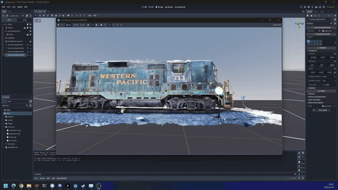

# gdgs: Godot Gaussian Splatting

维护者：ReconWorldLab

[English README](README.md)

当前插件版本：`2.1.0`

## 0x00 什么是 3DGS

3DGS（`3D Gaussian Splatting`）可以理解为一种新的三维渲染管线。它不再使用传统三角形 mesh 来表达场景，而是使用大量 3D Gaussian 原语来重建和渲染视图，因此通常能够带来更细腻、更高质量的实时渲染效果。

### 效果展示

以下 GIF 由 `gdgs-github` 目录下的视频转换而来：

| Room 0 | Room 1 |
| --- | --- |
|  |  |

| Train | Truck |
| --- | --- |
|  |  |

## 0x01 为什么需要这个插件

3DGS 的渲染方式和 Godot 原生的 mesh 渲染管线并不相同，Godot 目前也没有内建完整的 3D Gaussian Splatting 导入、渲染和合成能力。

`gdgs` 的作用就是把这部分能力补上：

- 导入并管理受支持的 3DGS 资源。
- 让 `GaussianSplatNode` 接入 Godot 场景工作流。
- 通过 `CompositorEffect` 与常规 3D 内容进行混合渲染。
- 基于场景深度完成遮挡、深度测试和深度合成。

## 0x02 如何使用

### 环境要求

- Godot `4.4` 或更新版本。
- 使用 `Forward Plus` 渲染后端。
- 支持 compute shader 的桌面 GPU 和驱动。
- 一份受支持格式的 Gaussian 资源文件。

### 安装方法

1. 如果你的 Godot 项目里还没有 `addons` 目录，先创建它。
2. 将本仓库中的 `addons/gdgs` 文件夹复制到项目中，目标路径为 `addons/gdgs`。
3. 使用 Godot 打开项目。
4. 进入 `Project > Project Settings > Plugins`。
5. 启用 `gdgs` 插件。

安装完成后，插件根目录应位于 `res://addons/gdgs`。

### 快速开始

1. 将一个受支持的 Gaussian 资源加入项目。本仓库附带了 `samples/assets/demo.ply`、`samples/assets/demo.compressed.ply` 和 `samples/assets/demo.sog` 作为示例。
2. 等待 Godot 将其导入为资源。
3. 在场景中添加一个 `GaussianSplatNode`。
4. 将导入后的资源赋值给 `GaussianSplatNode` 的 `gaussian` 属性。
5. 在场景中添加一个 `WorldEnvironment` 节点。
6. 在 `WorldEnvironment.compositor` 上创建一个 `Compositor` 资源。
7. 在该 `Compositor` 中添加一个 `CompositorEffect`，并将脚本设为 `res://addons/gdgs/runtime/compositor/gaussian_compositor_effect.gd`。
8. 运行场景。

## 0x03 版本记录

版本说明：历史中的 `1.0` 在这里按 semver 统一记为 `1.0.0`。

### 2.1.0

- 修复了 Godot 4 compositor 路径下屏幕空间协方差投影回归问题，该问题会导致 splat 旋转方向错误。
- 修正 2D 协方差投影链路，改为使用 `screen_transform = jacobian * mat3(view_matrix)` 和 `cov_2d = screen_transform * cov_3d * transpose(screen_transform)`。
- 修复了 compositor / Vulkan 投影符号问题：`RenderData` 可能提供 `projection.y.y` 为负的投影矩阵以编码渲染目标 Y 翻转，旧逻辑会因此反转协方差投影使用的 Y 方向 clamp 范围。
- 提升 Gaussian 导入器格式版本，强制仍然带有旧 `.res` 导入结果的 Godot 项目重新生成资源。

| 2.1.0 之前 | 2.1.0 之后 |
| --- | --- |
|  |  |

### 2.0.0

- 仓库结构重组为正式发布形态：`addons/gdgs`、`docs`、`samples`。
- 渲染链路按职责拆分为管理器生命周期、场景注册、GPU 状态缓存和逐帧执行四个模块。
- 主要运行时与编辑器入口脚本全部按新结构重命名和重排。
- 修复了 macOS / Metal 下 indirect dispatch 导致整条 GS 渲染链空白的问题。
- 修复了 Godot 4.4 下 descriptor set 类型、compute list 类型和 overlay 释放相关的回归。
- 修复了 `GaussianSplatNode` 复制与序列化时变换被重复处理的问题。
- 修复了朝向修正之后 gizmo 与实际渲染不一致的问题。
- 同步更新了文档、示例路径和仓库说明。

### 1.1.0

- 新增 `.compressed.ply`、`.splat` 和 `.sog` 导入支持。
- 将多种输入格式统一整理为共享的 GPU 可用 Gaussian 资源构建流程。
- 导入阶段默认对 Gaussian 数据做居中处理，便于放入场景。
- 为新加入场景的 `GaussianSplatNode` 增加默认的 Z 轴朝向修正行为。
- 扩展了 README、示例说明和插件版本元数据，形成 `1.1.0` 版本。

### 1.0.0

- 首个公开版本。
- 支持标准 Gaussian `.ply` 导入。
- 支持基于 compositor 的 Gaussian 渲染与场景深度合成。
- 支持多节点同时渲染。
- 支持编辑器预览、gizmo 和调试视图。

## 0x04 功能特性

- 支持导入 `.ply`、`.compressed.ply`、`.splat` 和 `.sog` 格式的 Gaussian 资源。
- 将不同输入格式统一转换为共享的 GPU 可用 Gaussian 资源。
- 导入构建时默认对 Gaussian 数据做居中处理。
- 当 `GaussianSplatNode` 以默认朝向进入场景树时，会自动初始化一个 `-180` 度的 Z 轴修正。
- 支持在同一场景中渲染一个或多个 `GaussianSplatNode`。
- 通过 `WorldEnvironment.compositor` 与常规 Godot 3D 场景进行合成。
- 基于场景深度缓冲进行遮挡混合。
- 支持编辑器内预览和 gizmo 操作。
- 内置 alpha、颜色、GS 深度、场景深度和深度剔除遮罩等调试视图。

## 0x05 场景说明

- `GaussianSplatNode` 只负责保存变换和资源引用，实际渲染由 compositor pass 完成，不走 Godot 标准 mesh 渲染管线。
- 支持多个 `GaussianSplatNode` 同时存在，并在同一个 Gaussian pass 中统一渲染。
- 导入后的 Gaussian 数据会按平均位置做居中处理，因此默认更接近场景原点。
- 新加入场景且仍为默认朝向的 `GaussianSplatNode` 会在进入场景树时只做一次 Z 轴修正，避免复制或序列化后的节点再次被重复修正。
- 如果你替换了源资源文件内容，请在 Godot 中重新导入，以确保生成资源与源文件保持同步。

## 0x06 后处理参数

compositor effect 脚本位于 `res://addons/gdgs/runtime/compositor/gaussian_compositor_effect.gd`。

- `alpha_cutoff`：Alpha 低于该阈值的像素会在最终合成时被忽略。
- `depth_bias`：GS 深度与场景深度比较时使用的小偏移量。
- `depth_test_min_alpha`：只有当 GS alpha 高于该阈值时才应用深度剔除。
- `debug_view`：调试输出模式。

`debug_view` 可选项：

- `Composite`：最终合成结果。
- `GS Alpha`：Gaussian alpha 缓冲。
- `GS Color`：Gaussian 颜色缓冲。
- `GS Depth`：Gaussian 深度缓冲。
- `Scene Depth`：场景深度缓冲。
- `Depth Reject Mask`：显示哪些 GS 像素因为深度测试被剔除。

## 0x07 支持的格式

### 标准 Gaussian `.ply`

导入器支持二进制小端的 Gaussian Splat `.ply` 文件，要求至少包含以下属性：

- 位置：`x`、`y`、`z`
- DC 颜色系数：`f_dc_0`、`f_dc_1`、`f_dc_2`
- 剩余 SH 系数：`f_rest_0` 到 `f_rest_44`
- 不透明度：`opacity`
- 缩放：`scale_0`、`scale_1`、`scale_2`
- 旋转：`rot_0`、`rot_1`、`rot_2`、`rot_3`

### `.compressed.ply`

- 通过独立的 compressed PLY 解码器导入。
- 可以通过 `.compressed.ply` 后缀或压缩顶点属性自动识别。

### 旧版 `.splat`

- 支持较早期的 Gaussian Splat record 格式资源。

### `.sog`

- 当前支持 SOG `v2` 归档格式。

该导入器面向 Gaussian Splatting 风格资源，不适用于通用点云文件。

## 0x08 仓库结构

- `addons/gdgs`：插件根目录。
- `addons/gdgs/importers`：导入插件、解析器、解码器和资源构建器。
- `addons/gdgs/runtime`：运行时节点、资源、compositor 代码和渲染模块。
- `addons/gdgs/editor`：编辑器侧扩展，例如 gizmo。
- `docs`：架构说明和内部 review 文档。
- `samples/assets`：示例 Gaussian 资源。
- `samples/media`：截图和调试图片。

## 0x09 已知限制

- 当前仅面向桌面 `Forward Plus` 渲染。
- 依赖 Godot 的 compositor 与 compute 管线，因此不支持 compatibility 和 mobile 渲染器。
- 当前渲染管理器仍以共享的 root 级运行时管理器存在，复杂的编辑器多场景或多视口工作流仍需要进一步验证。
- 标准 `.ply` 仅支持 Gaussian Splat 所需的二进制小端布局，不支持任意点云属性结构。
- `.sog` 当前仅支持 `v2` 格式。

## 0x0A 致谢

- 本项目中的 shader 实现参考了 [2Retr0/GodotGaussianSplatting](https://github.com/2Retr0/GodotGaussianSplatting)。感谢 2Retr0 公开该项目。
- 上游 `2Retr0/GodotGaussianSplatting` 仓库采用 MIT License。若你复用与其实现密切相关的衍生内容，请同时检查并保留相应的上游许可说明。
- radix sort 相关 shader 文件也保留了各自的上游来源说明，详见对应 shader 文件头部注释。

## 0x0B 参考资料

- [2Retr0/GodotGaussianSplatting](https://github.com/2Retr0/GodotGaussianSplatting)
- [3D Gaussian Splatting for Real-Time Radiance Field Rendering](https://arxiv.org/abs/2308.04079)

## 0x0C 许可证

本项目采用 [MIT License](LICENSE)。
